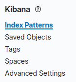
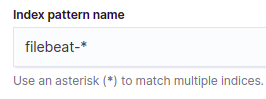
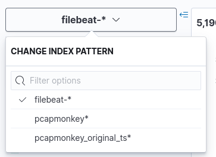

# Pcapmonkey
Pcapmonkey is a project that will provide an easy way to analyze pcap using the latest version of Suricata and Zeek.
It can also save Suricata and Zeek logs in Elasticsearch using the new Elasticsearch Common Schema or the original field names.

Pcapmonkey uses the default docker container for most images and aims to be easy and straightforward to use.

Video tutorial: [Startup](https://www.youtube.com/watch?v=h0bardzCOM4), [Pcap Analysis](https://www.youtube.com/watch?v=zVlFRs2vCQg)

## PcapMonkey is partecipating to GSoC 2021 thanks to Honeynet project!
### The Honeynet Project
<a href="https://www.honeynet.org">  </a>

### Google Summer Of Code

Since its birth, this project has been partecipating to the GSoC under the Honeynet Project!

* 2021: [Projects available](https://www.honeynet.org/gsoc/gsoc-2021/google-summer-of-code-2021-project-ideas/)

Stay tuned for the upcoming GSoC! Join the [Honeynet Slack chat](https://gsoc-slack.honeynet.org/) for more info.

# Install & uninstall
Install Docker-CE and docker-compose:
- https://docs.docker.com/install/linux/docker-ce/ubuntu/
- https://docs.docker.com/compose/install/

## Uninstall
To uninstall and remove all files delete all containers with
```
sudo docker-compose down -v
```
Then you can safely delete this repository.

# Basic Usage

## Start Elasticsearch stack

To start Elasticsearch, Logstash and Kibana run the following command
```
sudo docker-compose up -d elasticsearch logstash kibana
```

Use the following command to check if everything is working properly:
```
sudo docker-compose ps
```
The output should be the following:
```
Name                       Command                       State                    Ports          
---------------------------------------------------------------------------------------------------------
pcapmonkey_elasticsearch   /usr/local/bin/docker-entr ...   Up (health: starting)   9200/tcp, 9300/tcp      
pcapmonkey_logstash        /usr/local/bin/docker-entr ...   Up                                              
pcapmonkey_kibana          /usr/local/bin/dumb-init - ...   Up (health: starting)   127.0.0.1:5601->5601/tcp
```

Kibana and elasticsearch could take a couple of minutes to start. You can monitor the progress by doing `docker-compose ps` and waiting for `starting` to go away.

When everything is up and running you can go to http://localhost:5601 to open Kibana web interface.
At the first access you should see the following screen:


Click **"Explore on my own"** to close the window.

Now we can import the panoptikon index patterns, they will be used to access our pcap data. To do so click the Management icon (the cog):


Then click "Saved object":


Then open the Import dialog and import `kibana.ndjson` file from this repository. Now going back in Kibana discover you should see two index patterns called `pcapmonkey*` and `pcapmonkey_original_ts*`.


## Managing Suricata Signatures
Use the following command to download all Open ET rules:
```
sudo docker-compose run --entrypoint='suricata-update -f' suricata
```
This command will download the rules and create a rule file in `./config/suricata/rules/suricata.rules`.

If you want to test custom rules add them in `./config/suricata/rules/custom.rules` file.

## Analyzing a PCAP
Put one `pcap` file inside the `pcap` folder.

**WARNING**: The files should have a `.pcap` extension, rename your files if they use `.pcapng` extension

Start zeek and suricata containers:
```
sudo docker-compose up zeek suricata
```

The containers will print the output on the console and exit when they finish processing the pcap.
You can see the results on Kibana: http://localhost:5601

In Kibana there are two index patterns: `pcapmonkey*` and `pcapmonkey_original_ts*` you can select those from the drop-down menu:


You can see both zeek and suricata logs from these index patterns. `pcapmonkey*` uses the default timestamp field (`@timestamp`) to show logs. That means log data are indexes when they are read. The original pcap time is saved in the `timestamp` field.

Meanwhile `pcapotikon_original_ts*` uses the original pcap time as the default timestamp so you can see the real timeline. Kibana, by default, shows the last 15 minutes of data, so if you are analyzing old pcaps remember to widen the search timewindows using the menu on the top right of the page.

When you are done to stop everything run:
```
sudo docker-compose stop
```

## Zeek Extracted Files

The file extraction plugin is automatically loaded in Zeek and the extracted files can be found in `./zeek/extracted_files`. The plugin configuration is in this file `./config/zeek/site/file-extraction/config.zeek`. You can add additional filetypes in the following file:

Example: to add Microsoft Office file extraction add the following line to `./config/zeek/site/file-extraction/config.zeek`:
```
@load ./plugins/extract-ms-office.zeek
```
You can find all supported file types in `.config/zeek/site/file-extraction/plugins`.

## Clean data
To clean logs on disk (everything on logs folder) run the following script:
```
(sudo) ./clean_logs.sh
```
`sudo` may be needed if you are running docker as root since the logs file are written by zeek and suricata containers.

If you have analyzed the same pcap dozen of times (to test out suricata rules) it could be useful to delete old data from elasticsearch. To do so you can open the Kibana web interface and follow this path:
```
Management -> Index Management -> select `panoptikon_original_ts` -> click "manage index" -> delete index
```

# Advanced Usage

## Lightweight usage: ditching elasticsearch (the hacker way)
If you prefer using the command line you can find suricata and zeek logs in the `./logs` directory.

If you don't want to waste time starting filebeat/elasticsearch/kibana go to `./zeek/site/local.zeek` and comment out the first line (`@load policy/tuning/json-logs.zeek`). Then start analyzing a new pcap and enjoy plaintext, tab-separated zeek logs. `awk` all the way, baby!

Even if you'd like to use directly the log file I suggest keeping them in `.json` format and use `jq` utility to query them. You can read a pretty good `jq` primer [here](https://www.gibiansky.com/blog/command-line/jq-primer/index.html)

## Import Windows Event logs
It's possible to import `.evtx` files in elasticsearch on index `windows_events` using the following command:
First, be sure to have elasticsearch up and running:
```
sudo docker-compose elasticsearch kibana
```

Then place every `.evtx` you want to import inside the folder `import_event_logs` and run the following command:
```
sudo docker-compose -f docker-compose.yaml -f docker-compose-evtxtoelk.yaml up evtxtoelk
```
Or you can use the following script that does the same:
```
sudo ./import_event_logs.sh
```

Now you can find the Event logs in `windows_events_original_ts` and in `windows_events`. Like suricata/zeek logs they are indexed by the original timestamp of the event and by ingestion timestamp

## Using Elastic Common Schema

If you would like like to use ECS (elastic common schema) to process your Zeek and Suricata logs you should launch also ``filebeat``

Start the Elasticsearch with filebeat container:
```
sudo docker-compose up -d elasticsearch filebeat kibana
```

Create a new index for filebeat.

```Stack Management -> Index Patterns -> Create new pattern.```



Enter index pattern name `filebeat-*` and select `@timestamp` as the time field.



You can view your logs in `filebeat-*` index in the Discover section.


